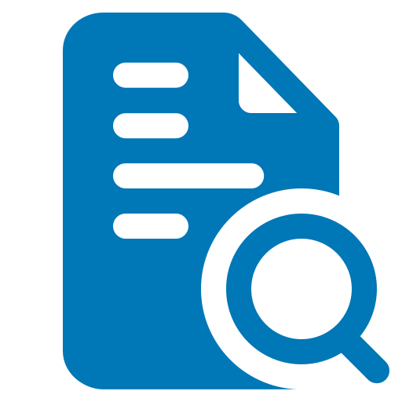




<span id="title" class="d-none">{{ title }}</span>

<frontmatter>
  title: "User Guide: {{ title }}"
  layout: userGuide.md
</frontmatter>

<span id="link" class="d-none">
<md>[_User Guide → {{ title }}_]({{ filename }}.html)</md>
</span>

# {{ title }}

<div class="lead" id="overview">

MarkBind allows you to start off your new project with different templates.
</div>

During initialization you can add a flag `--template <template-key>` to select a different template to initialize with. For example:

```
markbind init --template minimal
```

## Supported Templates

Name    | Template key | Description | Quick Deploy | Sample Site
----    | -------      | ----------- | ------------ | -------
Default | `default`    | Default template if `--template` is unspecified. Includes core features such as site and page navigation for a more convenient quick start. | <a href="https://app.netlify.com/start/deploy?repository=https://github.com/MarkBind/init-typical-netlify"></a> | <a href='https://markbind-template-typical.netlify.app'></a>
Minimal | `minimal`    | Minimalistic template that gets you started quickly. | <a href="https://app.netlify.com/start/deploy?repository=https://github.com/MarkBind/init-minimal-netlify"></a> | <a href='https://markbind-template-minimal.netlify.app'></a>
Project     | `project`        | Project documentation template serves as a good starting point for project developers. This template includes both a user guide and a developer guide, with some formatted dummy content. | <a href="https://app.netlify.com/start/deploy?repository=https://github.com/MarkBind/init-project-netlify"></a> | <a href="https://markbind-template-project.netlify.app/"></a>
Portfolio | `portfolio` | Portfolio template to quickly build your portfolio. | <a href="https://app.netlify.com/start/deploy?repository=https://github.com/MarkBind/init-portfolio-netlify"></a> | <a href="https://portfolio-template-markbind.netlify.app/"></a>


{{ previous_next('addingNavigationButtons', '') }}