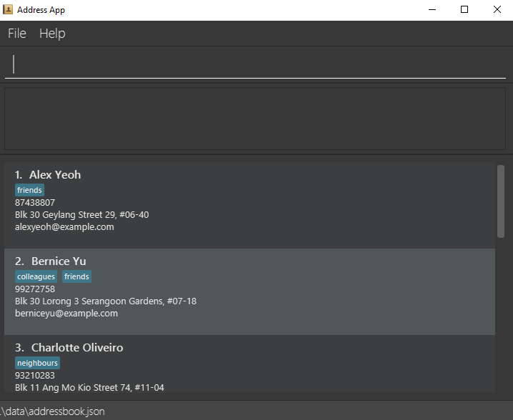

# Tutorial: Adding a command

Let's walk you through the implementation of a new command — `remark`.

This command allows users of the AddressBook application to add optional remarks to people in their address book and edit it if required. The command should have the following format:

`remark INDEX r/REMARK` (e.g., `remark 2 r/Likes baseball`)

We’ll assume that you have already set up the development environment as outlined in the Developer’s Guide.


## Create a new `remark` command

Looking in the `logic.command` package, you will notice that each existing command have their own class. All the commands inherit from the abstract class `Command` which means that they must override `execute()`. Each `Command` returns an instance of `CommandResult` upon success and `CommandResult#feedbackToUser` is printed to the `ResultDisplay`.

Let’s start by creating a new `RemarkCommand` class in the `src/main/java/seedu/address/logic/command` directory.

For now, let’s keep `RemarkCommand` as simple as possible and print some output. We accomplish that by returning a `CommandResult` with an accompanying message.

**`RemarkCommand.java`:**

```java
package seedu.address.logic.commands;

import seedu.address.model.Model;

/**
 * Changes the remark of an existing person in the address book.
 */
public class RemarkCommand extends Command {

    public static final String COMMAND_WORD = "remark";

    @Override
    public CommandResult execute(Model model) {
        return new CommandResult("Hello from remark");
    }
}
```

### Hook `RemarkCommand` into the application

Now that we have our `RemarkCommand` ready to be executed, we need to update `AddressBookParser#parseCommand()` to recognize the `remark` keyword. Add the new command to the `switch` block by creating a new `case` that returns a new instance of `RemarkCommand`.

You can refer to the changes in this [diff](https://github.com/se-edu/addressbook-level3/commit/35eb7286f18a029d39cb7a29df8f172a001e4fd8#diff-399c284cb892c20b7c04a69116fcff6ccc0666c5230a1db8e4a9145def8fa4ee).

### Run the application

Run `Main#main` and try out your new `RemarkCommand`. If everything went well, you should see something like this:


## Change `RemarkCommand` to throw an exception

While we have successfully printed a message to `ResultDisplay`, the command does not do what it is supposed to do. Let’s change the command to throw a `CommandException` to accurately reflect that our command is still a work in progress.

<puml src="../diagrams/add-remark/RemarkClass.puml" alt="The relationship between RemarkCommand and Command"/>

Following the convention in other commands, we add relevant messages as constants and use them.

**`RemarkCommand.java`:**

```java
    public static final String MESSAGE_USAGE = COMMAND_WORD
            + ": Edits the remark of the person identified "
            + "by the index number used in the last person listing. "
            + "Existing remark will be overwritten by the input.\n"
            + "Parameters: INDEX (must be a positive integer) "
            + "r/ [REMARK]\n"
            + "Example: " + COMMAND_WORD + " 1 "
            + "r/ Likes to swim.";

    public static final String MESSAGE_NOT_IMPLEMENTED_YET =
            "Remark command not implemented yet";

    @Override
    public CommandResult execute(Model model) throws CommandException {
        throw new CommandException(MESSAGE_NOT_IMPLEMENTED_YET);
    }
```

## Enhancing `RemarkCommand`

Let’s change `RemarkCommand` to parse input from the user.

### Make the command accept parameters

We start by modifying the constructor of `RemarkCommand` to accept an `Index` and a `String`. While we are at it, let’s change the error message to echo the values. While this is not a replacement for tests, it is an obvious way to tell if our code is functioning as intended.

```java
import static seedu.address.commons.util.CollectionUtil.requireAllNonNull;
//...
public class RemarkCommand extends Command {
    //...
    public static final String MESSAGE_ARGUMENTS = "Index: %1$d, Remark: %2$s";

    private final Index index;
    private final String remark;

    /**
     * @param index of the person in the filtered person list to edit the remark
     * @param remark of the person to be updated to
     */
    public RemarkCommand(Index index, String remark) {
        requireAllNonNull(index, remark);

        this.index = index;
        this.remark = remark;
    }
    @Override
    public CommandResult execute(Model model) throws CommandException {
        throw new CommandException(
                String.format(MESSAGE_ARGUMENTS, index.getOneBased(), remark));
    }

    @Override
    public boolean equals(Object other) {
        if (other == this) {
            return true;
        }

        // instanceof handles nulls
        if (!(other instanceof RemarkCommand)) {
            return false;
        }

        RemarkCommand e = (RemarkCommand) other;
        return index.equals(e.index)
                && remark.equals(e.remark);
    }
}
```

Your code should look something like [this](https://github.com/se-edu/addressbook-level3/commit/dc6d5139d08f6403da0ec624ea32bd79a2ae0cbf#diff-a8e35af8f9c251525063fae36c9852922a7e7195763018eacec60f3a4d87c594) after you are done.

### Parse user input

Now let’s move on to writing a parser that will extract the index and remark from the input provided by the user.

Create a `RemarkCommandParser` class in the `seedu.address.logic.parser` package. The class must extend the `Parser` interface.

<puml src="../diagrams/add-remark/ParserClass.puml" alt="The relationship between Parser and RemarkCommandParser"/>

Thankfully, `ArgumentTokenizer#tokenize()` makes it trivial to parse user input. Let’s take a look at the JavaDoc provided for the function to understand what it does.

**`ArgumentTokenizer.java`:**

```java
/**
 * Tokenizes an arguments string and returns an {@code ArgumentMultimap}
 * object that maps prefixes to their respective argument values. Only the
 * given prefixes will be recognized in the arguments string.
 *
 * @param argsString Arguments string of the form:
 * {@code preamble <prefix>value <prefix>value ...}
 * @param prefixes   Prefixes to tokenize the arguments string with
 * @return           ArgumentMultimap object that maps prefixes to their
 * arguments
 */
```

We can tell `ArgumentTokenizer#tokenize()` to look out for our new prefix `r/` and it will return us an instance of `ArgumentMultimap`. Now let’s find out what we need to do in order to obtain the Index and String that we need. Let’s look through `ArgumentMultimap` :

**`ArgumentMultimap.java`:**

```java
/**
 * Returns the last value of {@code prefix}.
 */
public Optional<String> getValue(Prefix prefix) {
    List<String> values = getAllValues(prefix);
    return values.isEmpty() ? Optional.empty() :
        Optional.of(values.get(values.size() - 1));
}
```

This appears to be what we need to get a String of the remark. But what about the Index? Let's take a quick peek at existing `Command` that uses an index to see how it is done.

**`DeleteCommandParser.java`:**

```java
Index index = ParserUtil.parseIndex(args);
return new DeleteCommand(index);
```

There appears to be another utility class that obtains an `Index` from the input provided by the user.

Now that we have the know-how to extract the data that we need from the user’s input, we can parse the user command and create a new instance of `RemarkCommand`, as given below.

**`RemarkCommandParser.java`:**

```java
public RemarkCommand parse(String args) throws ParseException {
    requireNonNull(args);
    ArgumentMultimap argMultimap = ArgumentTokenizer.tokenize(args,
        PREFIX_REMARK);

    Index index;
    try {
        index = ParserUtil.parseIndex(argMultimap.getPreamble());
    } catch (IllegalValueException ive) {
        throw new ParseException(String.format(MESSAGE_INVALID_COMMAND_FORMAT,
            RemarkCommand.MESSAGE_USAGE), ive);
    }

    String remark = argMultimap.getValue(PREFIX_REMARK).orElse("");

    return new RemarkCommand(index, remark);
}
```

<box type="info" seamless>

Don’t forget to update `AddressBookParser` to use our new `RemarkCommandParser`!

</box>

If you are stuck, check out the sample
[here](https://github.com/se-edu/addressbook-level3/commit/dc6d5139d08f6403da0ec624ea32bd79a2ae0cbf#diff-8bf239e8e9529369b577701303ddd96af93178b4ed6735f91c2d8488b20c6b4a).

## Add `Remark` to the model

Now that we have all the information that we need, let’s lay the groundwork for propagating the remarks added into the in-memory storage of person data. We achieve that by working with the `Person` model. Each field in a Person is implemented as a separate class (e.g. a `Name` object represents the person’s name). That means we should add a `Remark` class so that we can use a `Remark` object to represent a remark given to a person.

### Add a new `Remark` class

Create a new `Remark` in `seedu.address.model.person`. Since a `Remark` is a field that is similar to `Address`, we can reuse a significant bit of code.

A copy-paste and search-replace later, you should have something like [this](https://github.com/se-edu/addressbook-level3/commit/4516e099699baa9e2d51801bd26f016d812dedcc#diff-41bb13c581e280c686198251ad6cc337cd5e27032772f06ed9bf7f1440995ece). Note how `Remark` has no constrains and thus does not require input
validation.

### Make use of `Remark`

Let’s change `RemarkCommand` and `RemarkCommandParser` to use the new `Remark` class instead of plain `String`. These should be relatively simple changes.

## Add a placeholder element for remark to the UI

Without getting too deep into `fxml`, let’s go on a 5 minute adventure to get some placeholder text to show up for each person.

Simply add the following to [`seedu.address.ui.PersonCard`](https://github.com/se-edu/addressbook-level3/commit/850b78879582f38accb05dd20c245963c65ea599#diff-639834f1e05afe2276a86372adf0fe5f69314642c2d93cfa543d614ce5a76688).

**`PersonCard.java`:**

```java
@FXML
private Label remark;
```


`@FXML` is an annotation that marks a private or protected field and makes it accessible to FXML. It might sound like Greek to you right now, don’t worry — we will get back to it later.

Then insert the following into [`main/resources/view/PersonListCard.fxml`](https://github.com/se-edu/addressbook-level3/commit/850b78879582f38accb05dd20c245963c65ea599#diff-d44c4f51c24f6253c277a2bb9bc440b8064d9c15ad7cb7ceda280bca032efce9).

**`PersonListCard.fxml`:**

``` xml
<Label fx:id="remark" styleClass="cell_small_label" text="\$remark" />
```

That’s it! Fire up the application again and you should see something like this:


## Modify `Person` to support a `Remark` field

Since `PersonCard` displays data from a `Person`, we need to update `Person` to get our `Remark` displayed!

### Modify `Person`

We change the constructor of `Person` to take a `Remark`. We will also need to define new fields and accessors accordingly to store our new addition.

### Update other usages of `Person`

Unfortunately, a change to `Person` will cause other commands to break, you will have to modify these commands to use the updated `Person`!

<box type="tip" seamless>

Use the `Find Usages` feature in IntelliJ IDEA on the `Person` class to find these commands.

</box>

Refer to [this commit](https://github.com/se-edu/addressbook-level3/commit/ce998c37e65b92d35c91d28c7822cd139c2c0a5c) and check that you have got everything in order!


## Updating Storage

AddressBook stores data by serializing `JsonAdaptedPerson` into `json` with the help of an external library — Jackson. Let’s update `JsonAdaptedPerson` to work with our new `Person`!

While the changes to code may be minimal, the test data will have to be updated as well.

<box type="warning" seamless>

You must delete AddressBook’s storage file located at `/data/addressbook.json` before running it! Not doing so will cause AddressBook to default to an empty address book!

</box>

Check out [this commit](https://github.com/se-edu/addressbook-level3/commit/556cbd0e03ff224d7a68afba171ad2eb0ce56bbf)
to see what the changes entail.

## Finalizing the UI

Now that we have finalized the `Person` class and its dependencies, we can now bind the `Remark` field to the UI.

Just add [this one line of code!](https://github.com/se-edu/addressbook-level3/commit/5b98fee11b6b3f5749b6b943c4f3bd3aa049b692)

**`PersonCard.java`:**

```java
public PersonCard(Person person, int displayedIndex) {
    //...
    remark.setText(person.getRemark().value);
}
```



## Putting everything together

After the previous step, we notice a peculiar regression — we went from displaying something to nothing at all. However, this is expected behavior as we are yet to update the `RemarkCommand` to make use of the code we've been adding in the last few steps.

### Update `RemarkCommand` and `RemarkCommandParser`

In this last step, we modify `RemarkCommand#execute()` to change the `Remark` of a `Person`. Since all fields in a `Person` are immutable, we create a new instance of a `Person` with the values that we want and
save it with `Model#setPerson()`.

**`RemarkCommand.java`:**

```java
//...
    public static final String MESSAGE_ADD_REMARK_SUCCESS = "Added remark to Person: %1$s";
    public static final String MESSAGE_DELETE_REMARK_SUCCESS = "Removed remark from Person: %1$s";
//...
    @Override
    public CommandResult execute(Model model) throws CommandException {
        List<Person> lastShownList = model.getFilteredPersonList();

        if (index.getZeroBased() >= lastShownList.size()) {
            throw new CommandException(Messages.MESSAGE_INVALID_PERSON_DISPLAYED_INDEX);
        }

        Person personToEdit = lastShownList.get(index.getZeroBased());
        Person editedPerson = new Person(
                personToEdit.getName(), personToEdit.getPhone(), personToEdit.getEmail(),
                personToEdit.getAddress(), remark, personToEdit.getTags());

        model.setPerson(personToEdit, editedPerson);
        model.updateFilteredPersonList(PREDICATE_SHOW_ALL_PERSONS);

        return new CommandResult(generateSuccessMessage(editedPerson));
    }

    /**
     * Generates a command execution success message based on whether
     * the remark is added to or removed from
     * {@code personToEdit}.
     */
    private String generateSuccessMessage(Person personToEdit) {
        String message = !remark.value.isEmpty() ? MESSAGE_ADD_REMARK_SUCCESS : MESSAGE_DELETE_REMARK_SUCCESS;
        return String.format(message, personToEdit);
    }
```


## Writing tests

Tests are crucial to ensuring that bugs don’t slip into the codebase unnoticed. This is especially true for large code bases where a change might lead to unintended behavior.

Let’s verify the correctness of our code by writing some tests!

Of course you can simply add the test cases manually, like you've been doing all along this tutorial. The result would be like the test cases in [here](https://github.com/se-edu/addressbook-level3/commit/fac8f3fd855d55831ca0cc73313b5943d49d4d6e#diff-ff58f7c10338b34f76645df49b71ecb2bafaf7611b20e7ff59ebc98475538a01). Alternatively, you can get the help of IntelliJ to generate the skeletons of the test cases, as explained in the next section.

### Automatically generating tests

The goal is to write effective and efficient tests to ensure that `RemarkCommand#execute()` behaves as expected.

The convention for test names is `methodName_testScenario_expectedResult`. An example would be
`execute_filteredList_success`.

Let’s create a test for `RemarkCommand#execute()` to test that adding a remark works. On `IntelliJ IDEA` you can bring up the context menu and choose to `Go To` \> `Test` or use the appropriate keyboard shortcut.


Then, create a test for the `execute` method.


Following convention, let’s change the name of the generated method to `execute_addRemarkUnfilteredList_success`.

Let’s use the utility functions provided in `CommandTestUtil`. The functions ensure that commands produce the expected `CommandResult` and output the correct message. In this case, `CommandTestUtil#assertCommandSuccess` is the best fit as we are testing that a `RemarkCommand` will successfully add a `Remark`.

You should end up with a test that looks something like [this](https://github.com/se-edu/addressbook-level3/commit/fac8f3fd855d55831ca0cc73313b5943d49d4d6e#diff-ff58f7c10338b34f76645df49b71ecb2bafaf7611b20e7ff59ebc98475538a01R36-R49).

## Conclusion

This concludes the tutorial for adding a new `Command` to AddressBook.
