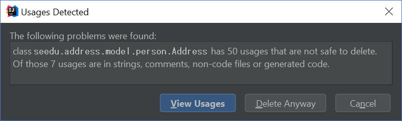
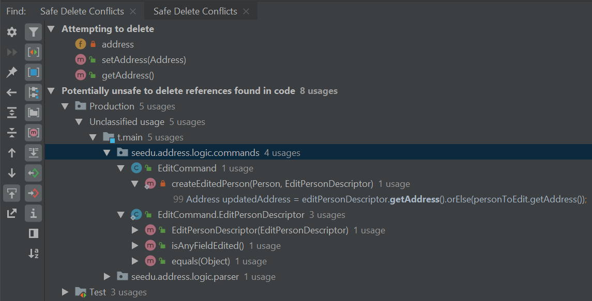

# Tutorial: Removing Fields

> Perfection is achieved, not when there is nothing more to add, but when there is nothing left to take away.
>
> —  Antoine de Saint-Exupery

When working on an existing code base, you will most likely find that some features that are no longer necessary.
This tutorial aims to give you some practice on such a code 'removal' activity by removing the `address` field from `Person` class.

<box type="success">

**If you have done the [Add `remark` command tutorial](AddRemark.html)  already**, you should know where the code had to be updated to add the field `remark`. From that experience, you can deduce where the code needs to be changed to _remove_ that field too. The removing of the `address` field can be done similarly.
<br>
<br>
However, if you have no such prior knowledge, removing a field can take a quite a bit of detective work. This tutorial takes you through that process. **At least have a read even if you don't actually do the steps yourself.**
</box>


<!-- * Table of Contents -->
<!-- {:toc} -->

## Safely deleting `Address`

IntelliJ IDEA provides a refactoring tool that can identify *most* parts of a removal easily. Let’s try to use it as much as we can.

### Assisted refactoring

The `address` field in `Person` is actually an instance of the `seedu.address.model.person.Address` class. Since removing the `Address` class will break the application, we start by identifying `Address`'s usages. This allows us to see code that depends on `Address` to function properly and edit them on a case-by-case basis. Right-click the `Address` class and select `Refactor` \> `Safe Delete` through the menu.
* :bulb: To make things simpler, you can unselect the options `Search in comments and strings` and `Search for text occurrences`



Choose to `View Usages` and you should be presented with a list of `Safe Delete Conflicts`. These conflicts describe locations in which the `Address` class is used.


Remove usages of `Address` by performing `Safe Delete`s on each entry i.e., double-click on the entry (which takes you to the code in concern, right-click on that entity, and choose `Refactor` -> `Safe delete` as before). You will need to exercise discretion when removing usages of `Address`. Functions like `ParserUtil#parseAddress()` can be safely removed but its usages must be removed as well. Other usages like in `EditPersonDescriptor` may require more careful inspection.

Let’s try removing references to `Address` in `EditPersonDescriptor`.

1. Safe delete the field `address` in `EditPersonDescriptor`.

1. Select `Yes` when prompted to remove getters and setters.

1. Select `View Usages` again.<br>
   

1. Remove the usages of `address` and select `Do refactor` when you are done.

   <box type="tip" seamless>

   **Tip:** Removing usages may result in errors. Exercise discretion and fix them. For example, removing the `address` field from the `Person` class will require you to modify its constructor.
   </box>

1. Repeat the steps for the remaining usages of `Address`

After you are done, verify that the application still works by compiling and running it again.

### Manual refactoring

Unfortunately, there are usages of `Address` that IntelliJ IDEA cannot identify. You can find them by searching for instances of the word `address` in your code (`Edit` \> `Find` \> `Find in path`).

Places of interest to look out for would be resources used by the application. `main/resources` contains images and `fxml` files used by the application and `test/resources` contains test data. For example, there is a `$address` in each `PersonCard` that has not been removed nor identified.


A quick look at the `PersonCard` class and its `fxml` file quickly reveals why it slipped past the automated refactoring.

**`PersonCard.java`**

```java
...
@FXML
private Label address;
...
```

**`PersonCard.fxml`**

``` xml
...
<Label fx:id="phone" styleClass="cell_small_label" text="\$phone" />
<Label fx:id="address" styleClass="cell_small_label" text="\$address" />
<Label fx:id="email" styleClass="cell_small_label" text="\$email" />
...
```

After removing the `Label`, we can proceed to formally test our code. If everything went well, you should have most of your tests pass. Fix any remaining errors until the tests all pass.

## Tidying up

At this point, your application is working as intended and all your tests are passing. What’s left to do is to clean up references to `Address` in test data and documentation.

In `src/test/data/`, data meant for testing purposes are stored. While keeping the `address` field in the json files does not cause the tests to fail, it is not good practice to let cruft from old features accumulate.

**`invalidPersonAddressBook.json`:**

```json
{
  "persons": [ {
    "name": "Person with invalid name field: Ha!ns Mu@ster",
    "phone": "9482424",
    "email": "hans@example.com",
    "address": "4th street"
  } ]
}
```

You can go through each individual `json` file and manually remove the `address` field.
