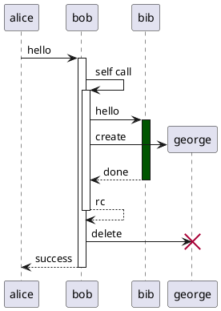
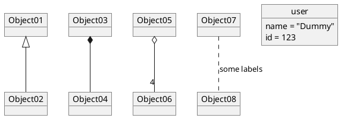

**PlantUML Test**

**Sequence Diagram**
<puml src="diagrams/sequence.puml" />

**Use Case Diagram**
<puml src="diagrams/usecase.puml" />

**Class Diagram**
<puml src="diagrams/class.puml" />

**Activity Diagram**
<puml src="diagrams/activity.puml" />

**Component Diagram**
<puml src="diagrams/component.puml" />

**State Diagram**
<puml src="diagrams/state.puml" />

**Object Diagram**
<puml src="diagrams/object.puml" />

**PlantUML Inline Test**

<puml name="inline-output">

</puml>

<puml>

</puml>